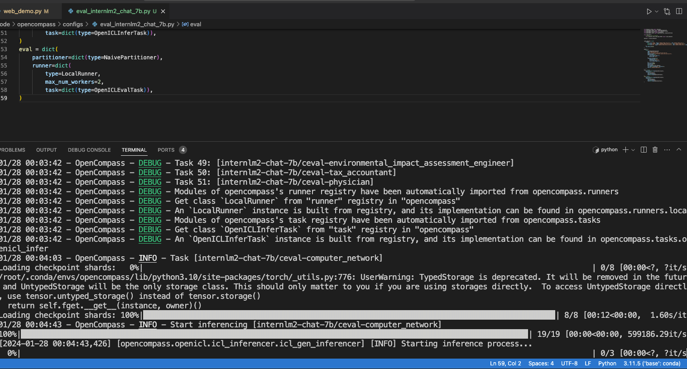

```python
from mmengine.config import read_base
from opencompass.models import HuggingFaceCausalLM
from opencompass.partitioners import NaivePartitioner
from opencompass.runners import LocalRunner
from opencompass.tasks import OpenICLEvalTask, OpenICLInferTask

with read_base():
    # choose a list of datasets
    from .datasets.ceval.ceval_gen_5f30c7 import ceval_datasets

datasets = [*ceval_datasets]


_meta_template = dict(
    round=[
        dict(role='HUMAN', begin='[UNUSED_TOKEN_146]user\n', end='[UNUSED_TOKEN_145]\n'),
        dict(role='SYSTEM', begin='[UNUSED_TOKEN_146]system\n', end='[UNUSED_TOKEN_145]\n'),
        dict(role='BOT', begin='[UNUSED_TOKEN_146]assistant\n', end='[UNUSED_TOKEN_145]\n', generate=True),
    ],
    eos_token_id=92542
)

models = [
    dict(
        type=HuggingFaceCausalLM,
        abbr='internlm2-chat-7b',
        path="/share/model_repos/internlm2-chat-7b",
        tokenizer_path='/share/model_repos/internlm2-chat-7b',
        model_kwargs=dict(
            trust_remote_code=True,
            device_map='auto',
        ),
        tokenizer_kwargs=dict(
            padding_side='left',
            truncation_side='left',
            trust_remote_code=True,
        ),
        max_out_len=100,
        max_seq_len=2048,
        batch_size=8,
        meta_template=_meta_template,
        run_cfg=dict(num_gpus=1, num_procs=1),
        end_str='[UNUSED_TOKEN_145]',
    )
]
infer = dict(
    partitioner=dict(type=NaivePartitioner),
    runner=dict(
        type=LocalRunner,
        max_num_workers=2,
        task=dict(type=OpenICLInferTask)),
)
eval = dict(
    partitioner=dict(type=NaivePartitioner),
    runner=dict(
        type=LocalRunner,
        max_num_workers=2,
        task=dict(type=OpenICLEvalTask)),
)
```

