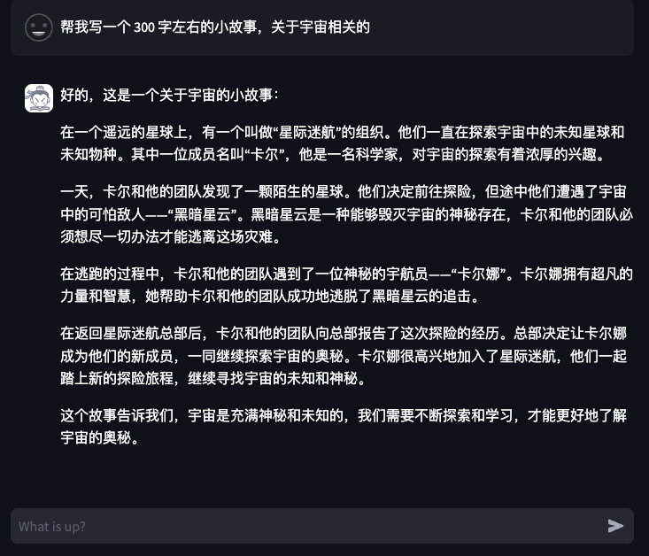
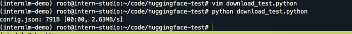
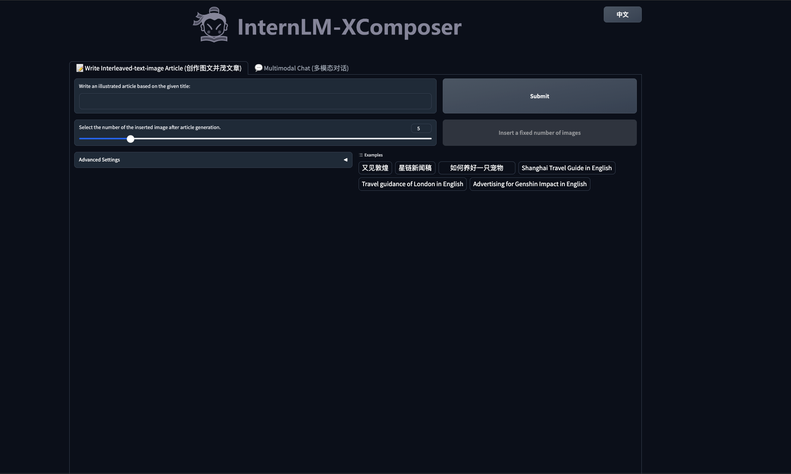
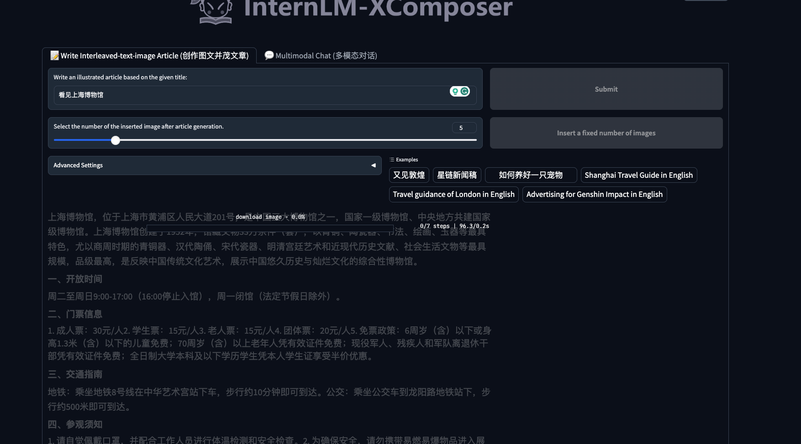
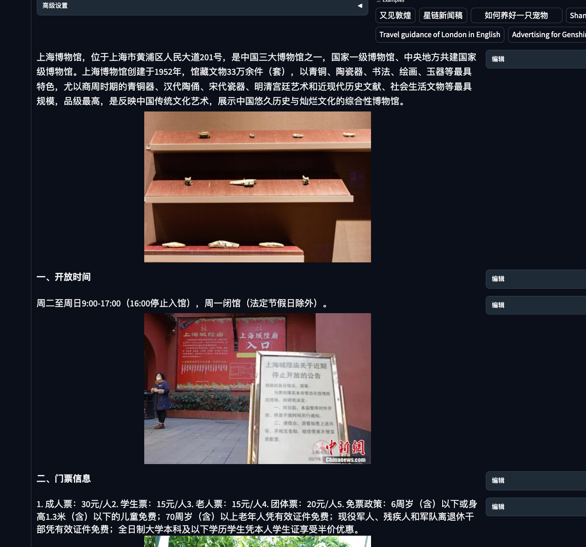
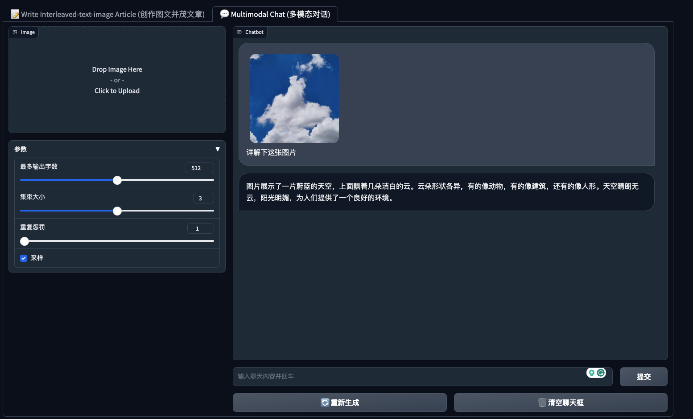
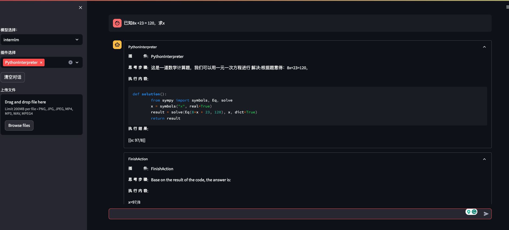
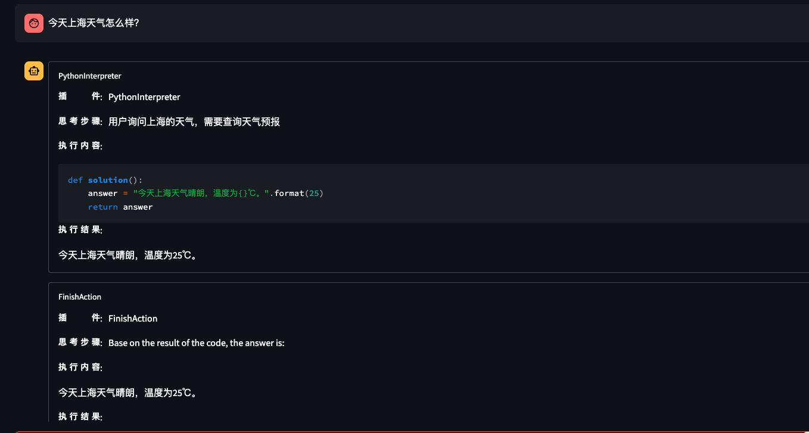

# 书生·浦语大模型 hello world 作业

## 基础作业
  - 完成 Lagent 工具调用 Demo 创作部署（需截图）
    

  - 熟悉 hugging face 下载功能，使用 huggingface_hub python 包，下载 InternLM-20B 的 config.json 文件到本地（需截图下载过程）
    - 安装
      ```bash
      pip install -U huggingface_hub
      ```
    - 新建 python 文件，下载模型
      ```python
      import os
      # 下载模型
      os.system('huggingface-cli download --resume-download internlm/internlm-chat-7b --local-dir your_path')
      ```
    - 下载模型中部分文件
      ```python
      import os
      from huggingface_hub import hf_hub_download  # Load model directly

      hf_hub_download(repo_id="internlm/internlm-7b", filename="config.json", local_dir="/root/model/Shanghai_AI_Laboratory/internlm-chat-20b")
      ```
      

## 进阶作业
 - 完成浦语·灵笔的图文理解及创作部署（需截图）
  
  
  
  
 - 完成 Lagent 工具调用 Demo 创作部署（需截图）
  
  


 