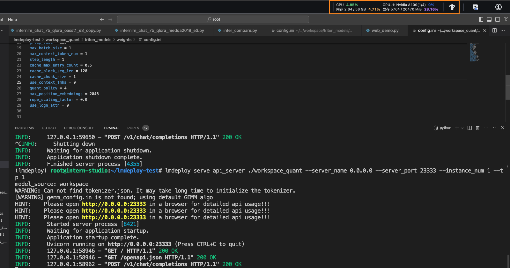

# 书生·浦语大模型 Lmdeploy 作业

## 基础作业

## 进阶作业
对internlm-chat-7b模型进行量化，并同时使用KV Cache量化，使用量化后的模型完成API服务的部署，分别对比模型量化前后（将 bs设置为 1 和 max len 设置为512）和 KV Cache 量化前后（将 bs设置为 8 和 max len 设置为2048）的显存大小。

- 未量化（max_batch_size = 8, max_len = 512）
    
    部署：

    推理：

    部署占用显存14718MB，推理占用显存14982MB

- KV Cache 量化（max_batch_size = 8, max_len = 512）
    部署：

    推理：

    部署占用显存14686MB，推理占用显存14758MB

- 未量化(max_batch_size = 1, max_len = 512)
    部署：

    推理：

    部署占用显存14718MB，推理占用显存14790MB

- W4A16(max_batch_size = 1, max_len = 512)
    部署：

    推理：

    部署占用显存5756MB，推理占用显存5824MB
    
- KV Cache 量化+ W4A16(max_batch_size = 1, max_len = 512)
    部署：!

    推理：

    部署占用显存5724MB，推理占用显存5764MB

| 类型                          | 部署显存占用 (MB) | 推理显存占用 (MB) |
|-----------------------------------------|------------------------|----------------------|
| 未量化 (max_batch_size = 8, max_len = 512) | 14718                  | 14982                |
| KV Cache 量化 (max_batch_size = 8, max_len = 512) | 14686                  | 14758                |
| 未量化 (max_batch_size = 1, max_len = 512) | 14718                  | 14790                |
| W4A16 (max_batch_size = 1, max_len = 512) | 5756                   | 5824                 |
| KV Cache 量化 + W4A16 (max_batch_size = 1, max_len = 512) | 5724                   | 5764                 |

