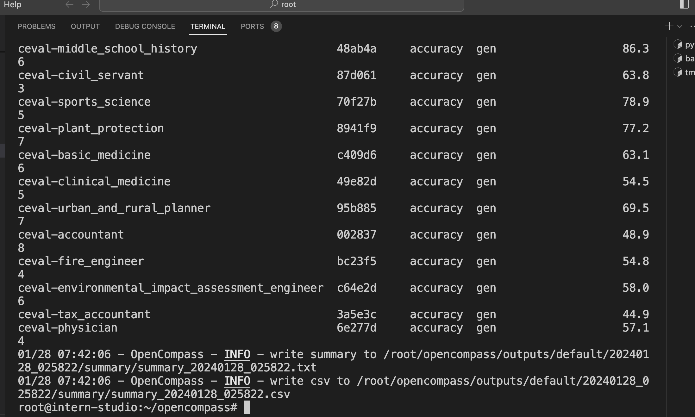

# 书生·浦语大模型 OpenCompass 作业

## 基础作业
- 创建configs/eval_internlm2_chat_7b.py
  ```python
    from mmengine.config import read_base
    from opencompass.models import HuggingFaceCausalLM
    from opencompass.partitioners import NaivePartitioner
    from opencompass.runners import LocalRunner
    from opencompass.tasks import OpenICLEvalTask, OpenICLInferTask

    with read_base():
        # choose a list of datasets
        from .datasets.ceval.ceval_gen_5f30c7 import ceval_datasets

    datasets = [*ceval_datasets]


    _meta_template = dict(
        round=[
            dict(role='HUMAN', begin='[UNUSED_TOKEN_146]user\n', end='[UNUSED_TOKEN_145]\n'),
            dict(role='SYSTEM', begin='[UNUSED_TOKEN_146]system\n', end='[UNUSED_TOKEN_145]\n'),
            dict(role='BOT', begin='[UNUSED_TOKEN_146]assistant\n', end='[UNUSED_TOKEN_145]\n', generate=True),
        ],
        eos_token_id=92542
    )
    models = [
        dict(
            type=HuggingFaceCausalLM,
            abbr='internlm2-chat-7b',
            path="/share/model_repos/internlm2-chat-7b",
            tokenizer_path='/share/model_repos/internlm2-chat-7b',
            model_kwargs=dict(
                trust_remote_code=True,
                device_map='auto',
            ),
            tokenizer_kwargs=dict(
                padding_side='left',
                truncation_side='left',
                trust_remote_code=True,
            ),
            max_out_len=100,
            max_seq_len=2048,
            batch_size=8,
            meta_template=_meta_template,
            run_cfg=dict(num_gpus=1, num_procs=1),
            end_str='[UNUSED_TOKEN_145]',
        )
    ]
    infer = dict(
        partitioner=dict(type=NaivePartitioner),
        runner=dict(
            type=LocalRunner,
            max_num_workers=2,
            task=dict(type=OpenICLInferTask)),
    )
    eval = dict(
        partitioner=dict(type=NaivePartitioner),
        runner=dict(
            type=LocalRunner,
            max_num_workers=2,
            task=dict(type=OpenICLEvalTask)),
    )
  ```
- 运行
```bash
python run.py configs/eval_internlm2_chat_7b.py
```
- 查看结果
  
- 完整数据
  | Dataset                            | Version | Metric   | Mode | internlm2-chat-7b |
  |------------------------------------|---------|----------|------|------------------|
  | ceval-computer_network             | db9ce2  | accuracy | gen  | 63.16            |
  | ceval-operating_system             | 1c2571  | accuracy | gen  | 68.42            |
  | ceval-computer_architecture        | a74dad  | accuracy | gen  | 57.14            |
  | ceval-college_programming          | 4ca32a  | accuracy | gen  | 56.76            |
  | ceval-college_physics              | 963fa8  | accuracy | gen  | 52.63            |
  | ceval-college_chemistry            | e78857  | accuracy | gen  | 33.33            |
  | ceval-advanced_mathematics         | ce03e2  | accuracy | gen  | 31.58            |
  | ceval-probability_and_statistics   | 65e812  | accuracy | gen  | 44.44            |
  | ceval-discrete_mathematics         | e894ae  | accuracy | gen  | 31.25            |
  | ceval-electrical_engineer          | ae42b9  | accuracy | gen  | 40.54            |
  | ceval-metrology_engineer           | ee34ea  | accuracy | gen  | 70.83            |
  | ceval-high_school_mathematics      | 1dc5bf  | accuracy | gen  | 33.33            |
  | ceval-high_school_physics          | adf25f  | accuracy | gen  | 42.11            |
  | ceval-high_school_chemistry        | 2ed27f  | accuracy | gen  | 47.37            |
  | ceval-high_school_biology          | 8e2b9a  | accuracy | gen  | 36.84            |
  | ceval-middle_school_mathematics    | bee8d5  | accuracy | gen  | 52.63            |
  | ceval-middle_school_biology        | 86817c  | accuracy | gen  | 80.95            |
  | ceval-middle_school_physics        | 8accf6  | accuracy | gen  | 68.42            |
  | ceval-middle_school_chemistry      | 167a15  | accuracy | gen  | 95               |
  | ceval-veterinary_medicine          | b4e08d  | accuracy | gen  | 43.48            |
  | ceval-college_economics            | f3f4e6  | accuracy | gen  | 50.91            |
  | ceval-business_administration      | c1614e  | accuracy | gen  | 57.58            |
  | ceval-marxism                      | cf874c  | accuracy | gen  | 84.21            |
  | ceval-mao_zedong_thought           | 51c7a4  | accuracy | gen  | 75               |
  | ceval-education_science            | 591fee  | accuracy | gen  | 72.41            |
  | ceval-teacher_qualification        | 4e4ced  | accuracy | gen  | 79.55            |
  | ceval-high_school_politics         | 5c0de2  | accuracy | gen  | 89.47            |
  | ceval-high_school_geography        | 865461  | accuracy | gen  | 63.16            |
  | ceval-middle_school_politics       | 5be3e7  | accuracy | gen  | 76.19            |
  | ceval-middle_school_geography      | 8a63be  | accuracy | gen  | 75               |
  | ceval-modern_chinese_history       | fc01af  | accuracy | gen  | 78.26            |
  | ceval-ideological_and_moral_cultivation | a2aa4a | accuracy | gen  | 89.47            |
  | ceval-logic                        | f5b022  | accuracy | gen  | 54.55            |
  | ceval-law                          | a110a1  | accuracy | gen  | 45.83            |
  | ceval-chinese_language_and_literature | 0f8b68 | accuracy | gen  | 56.52            |
  | ceval-art_studies                  | 2a1300  | accuracy | gen  | 66.67            |
  | ceval-professional_tour_guide      | 4e673e  | accuracy | gen  | 82.76            |
  | ceval-legal_professional           | ce8787  | accuracy | gen  | 52.17            |
  | ceval-high_school_chinese          | 315705  | accuracy | gen  | 63.16            |
  | ceval-high_school_history          | 7eb30a  | accuracy | gen  | 75               |
  | ceval-middle_school_history        | 48ab4a  | accuracy | gen  | 86.36            |
  | ceval-civil_servant                | 87d061  | accuracy | gen  | 63.83            |
  | ceval-sports_science               | 70f27b  | accuracy | gen  | 78.95            |
  | ceval-plant_protection             | 8941f9  | accuracy | gen  | 77.27            |
  | ceval-basic_medicine               | c409d6  | accuracy | gen  | 63.16            |
  | ceval-clinical_medicine            | 49e82d  | accuracy | gen  | 54.55            |
  | ceval-urban_and_rural_planner      | 95b885  | accuracy | gen  | 69.57            |
  | ceval-accountant                   | 2837    | accuracy | gen  | 48.98            |
  | ceval-fire_engineer                | bc23f5  | accuracy | gen  | 54.84            |
  | ceval-environmental_impact_assessment_engineer | c64e2d | accuracy | gen  | 58.06            |
  | ceval-tax_accountant               | 3a5e3c  | accuracy | gen  | 44.9             |
  | ceval-physician                    | 6e277d  | accuracy | gen  | 57.14            |
